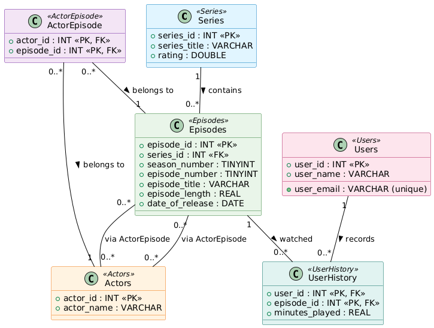

# TV Series Database Project

**Course:** CS6401 - Database Systems
**Institution:** University of Limerick
**Lecturer:** Nikola Nikolov

## 📖 Project Overview

This project implements a structured SQL-based solution for managing a TV series database. The system is designed to handle series data, episodes, actors, and user watch history. The completed work includes the development of SQL views, a trigger for automatic series rating updates, a stored procedure for controlled episode insertion, and a stored function for retrieving ordered episode title lists.

## 👥 Contributors

* **Vivek**
* **Francisco**

*All members of the group contributed equally to the design, execution, and review of the work.*

## 🛠️ Technical Stack

* **Database Language:** SQL
* **Platform Used for Testing:** XAMPP on Windows 11
* **Visualizations:** Entity-Relationship Diagram (ERD)

## 📂 Repository Structure

The project submission consists of the following key files:

1.  **`tv_series_schema.sql`**: Contains the `CREATE TABLE` statements to set up the relational database schema.
2.  **`tv_series_code.sql`**: Contains the source code for the required Views, Triggers, Stored Procedures, and Functions.
3.  **`tv_series_erd.png`**: The Entity-Relationship Diagram visualizing the database structure.
4.  **`tv_series_cp.pdf`**: Project cover page including student details and platform information.
5.  **`project_test_data.sql`**: Sample data provided to validate and test the system logic.

## 📊 Database Schema (ERD)

The database models the relationships between Series, Episodes, Actors, Users, and their viewing History.

## 🚀 Key Features & Implementation Details

The project fulfills specific SQL tasks as defined in the specification:

### 1. Views
* **`top_series_cast`**: Displays series with a rating of at least 4.00. It includes a comma-separated list of distinct actors appearing in that series.
* **`actor_minutes`**: Calculates the total minutes played by all users for episodes featuring a specific actor.

### 2. Triggers
* **`AdjustRating`**: A `BEFORE INSERT` trigger on the `user_history` table that:
    1.  **Validates Time**: Checks if `minutes_played` exceeds the actual episode length. If it does, the value is capped at the episode length.
    2.  **Updates Rating**: Increases the associated series rating by `0.0001 * minutes_played`, ensuring the rating does not exceed the maximum of 5.00.

### 3. Stored Procedures
* **`AddEpisode`**: Safely inserts a new episode. It validates that the `series_id` exists and that the specific episode number for that season does not already exist. It automatically sets the `date_of_release` to the current date.

### 4. Stored Functions
* **`GetEpisodeList`**: Accepts a series ID and season number, returning a comma-separated string of episode titles ordered by their episode number.

## 🧪 Installation and Testing Guide

To replicate the test environment, follow these steps:

1.  **Initialize Database**:
    Create a new database and import `tv_series_schema.sql` to generate the empty tables.
    *(Note: If using a shared server like CSIS, drop existing tables before importing)*.

2.  **Load Logic**:
    Run the script `tv_series_code.sql` to compile the Views, Triggers, Procedures, and Functions.

3.  **Load Test Data**:
    Import `project_test_data.sql` to populate the tables with initial records.

4.  **Verification**:
    * **Check Views**: Query `actor_minutes` and `top_series_cast` to ensure calculations match the test data.
    * **Test Trigger**: Insert a new record into `user_history` and verify that the `minutes_played` is clamped (if excessive) and the `series` rating updates correctly.
    * **Test Procedure**: Call `AddEpisode` with valid and invalid data to test constraints.
    * **Test Function**: Call `GetEpisodeList(1, 2)` or `GetEpisodeList(3, 1)` to see the concatenated titles.

## 📜 License & Academic Integrity

This project is part of the CS6401 module assessment.
